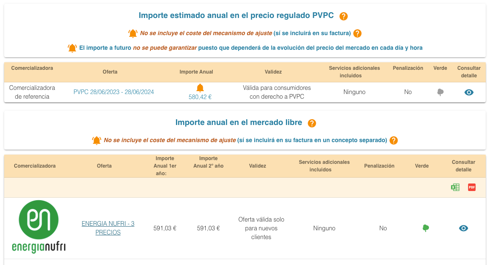
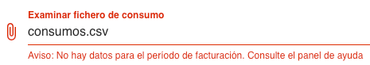
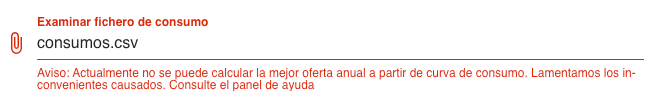

# Electricity consumption stats script
## TL;DR
Analyzes a CSV containing electricity consumption data exported from a Spanish electricity distributor company and prints total kWh consumed for data in the file + consumed kWh by rate (valley, plain, peak).

Run it by
```shell
pipenv install # dependencies
python main.py
```

Your consumptions CSV file must be named `consumption.csv`. A sample file can be found at [`consumption.example.csv`](./consumption.example.csv)

Export a year CSV if you want to obtain year data. A month if you want monthly data, ... Exporting a year should be more accurate to reflect spending across several seasons that require different energy usages (ACs in summer, heaters in winter, holidays...)

> Valley, plain, peak rates depend on the hour of day + if day is labour or holiday / weekend. Catalonia calendar of holidays has been used as I live there. You can specify another one by providing a different country subdivision [from the ones available in `python-holidays`](https://python-holidays.readthedocs.io/en/latest/) when creating the holiday calendar.

## Story
There's a tool in Spain provided by [public markets regulation authority CNMC](https://www.cnmc.es/sobre-la-cnmc/que-es-la-cnmc) that helps you compare between electric and gas power marketers so you can choose best rate for you. Tool is called [_Comparador de ofertas de energía_](https://comparador.cnmc.gob.es/). By providing your monthly / annual consumption data, it offers you public / regulated and private / free market rates available from several marketers, so you can choose best price available. You can compare how much you'd have paid for that period if electricity was provided by the listed marketers. 



To provide electricity consumption data, you can download a CSV file containing electricity consumption data from your electric distribution company\*. Then, you can upload that CSV file to the tool so it can know how much electricity you use.

> \***Marketers** are companies that sell electricity to you. **Distributors** are companies that manage electricity distribution to make it reach your house. They're different companies. You can know which distributor you are using to to get electricity from by checking your electricity bill.

Nice, huh? Well I've tried several times and can't upload that file:




So instead, you can provide that data yourself. However, it asks for total kWh consumed in a year + kWh consumed in valley / plain / peak rates. How do you know that?

Well that's what the script is for. Grabs the CSV and looks for that data. Export a year of usages in CSV, and you'll know the yearly consumption data.

### Archives
Following websites have been archived for future reference:
- [Comparador de ofertas de energía (2023-06-29)](https://web.archive.org/web/20230629105819/https://comparador.cnmc.gob.es/)
- [Tarifas valle, llano y pico @ Naturgy.es (2023-06-26)](https://web.archive.org/web/20230629110442/https://www.naturgy.es/blog/hogar/hora_luz_mas_barata)
- [Tarifas valle, llano y pico @ Endesa.com (2023-06-29) ](https://web.archive.org/web/20230629105102/https%3A%2F%2Fwww.endesa.com%2Fes%2Fblog%2Fblog-de-endesa%2Fhorarios-luz-valle-punta-llano)
  - ⚠️ You need to dig in source code to see something. Probably content hidden due to cookies banner